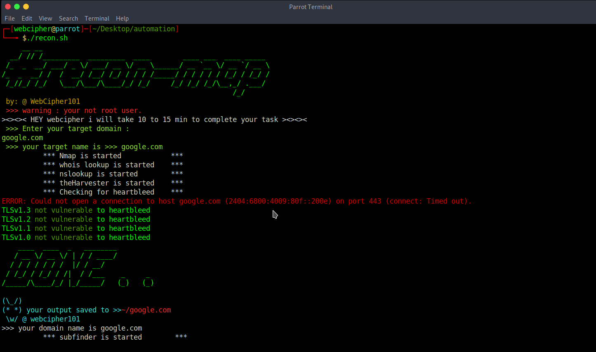

# Intro

A simple and easy to understand bash script to automate recon :)

>>> by : webcipher101
>>> to automate recon for bug hunting

>>> initial recon

>>> subdomain enumeration

>>> take screenshots of all subdomains

>>> url enumeration using gau and waybackurls

>>> open your default browser and search your target in shodan.io and censys.io

>>> if you have any issue about script dm me on <a href="https://twitter.com/webcipher101?s=09">@webcipher101</a>
>>> checkout my recon checklist also :- <a href="https://github.com/webcipher101/bug-hunting-recon-checklist">link</a>

# prerequisite :-

1.) install findomain tool manually <a href="https://github.com/Findomain/Findomain.git">link</a>

2.) install knockpy tool manually <a href="https://github.com/guelfoweb/knock.git">link</a>

3.) install gau tool manually <a href="https://github.com/lc/gau.git">link</a>

4.) install waybackurls tool manually <a href="https://github.com/tomnomnom/waybackurls.git">link</a>

5.) install aquatone tool manually <a href="https://github.com/michenriksen/aquatone.git">link</a>

# now install recon-map :-

1.) git clone https://github.com/webcipher101/recon-map.git

2.) cd recon-map
 
3.) chmod +x *

4.) ./setup.sh

5.) ./recon.sh

>>> enter your target name with (.com , .io , .net ,etc)
    example :- google.com
    
>>> it will take 15-20 minutes to complete a task , depends on your (target) and also on internet or pc speed.

>>> while subdomain enumeration it will open shodan.io and censys.io with your target search results in browser ,check it out.
>>> checkout all outputs in your target named folder.

thanks , for using recon-map.

Happy Hunting..!!

<a href="https://twitter.com/webcipher101?s=09">@webcipher101</a>
